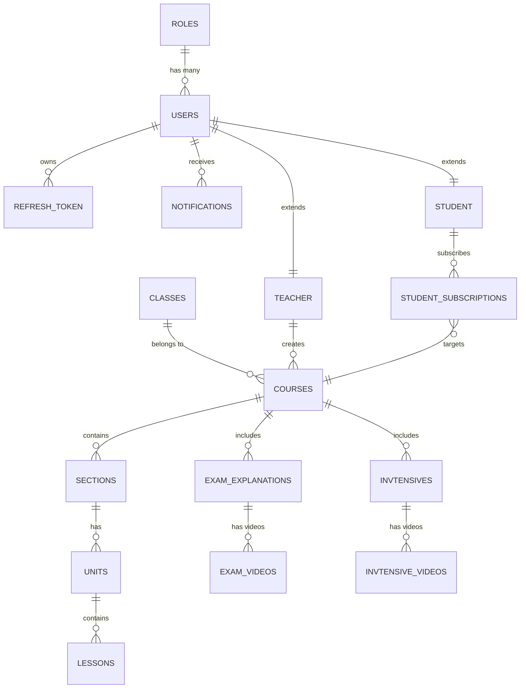

# 🎓 Learnova (Taleem Pro) - Advanced E-Learning System Backend

[](https://dotnet.microsoft.com/download/dotnet/8.0)
[]()
[]()
[]()

**Learnova** is a high-performance, scalable backend built with **.NET 8** and **Clean Architecture**. It manages a complex hierarchy of educational content including Courses, Intensives, and Exam Explanations with a secure subscription-based access model.


---

## 🏛 Clean Architecture Layers

The system is strictly decoupled into four layers:
1.  **Domain:** Core Entities (User, Course, etc.), Value Objects, and Domain Events.
2.  **Application:** Use cases (Commands/Queries), MediatR Handlers, and DTOs.
3.  **Infrastructure:** EF Core Data Access, Identity, Email (MailKit), and File Services.
4.  **Api:** Controllers, Middlewares, and Swagger Configuration.

---

## 📊 Database Schema & UML (ERD)

The following diagram represents the full relational structure as implemented in the database:



### 🗄️ Tables Breakdown:
*   **Identity:** `Users`, `Roles`, `RefreshTokens`.
*   **Content Core:** `Classes`, `Courses`.
*   **Curriculum:** `Sections` -> `Units` -> `Lessons`.
*   **Specialized Content:** 
    *   `ExamExplanations` & `ExamVideos` (Previous Years Exams).
    *   `Invtensives` & `InvtensiveVideos` (Intensive Review Courses).
*   **Business:** `StudentSubscriptions` (Handles receipts and Status: Pending/Completed).
*   **System:** `Notifications` (Real-time SignalR logs).

---

## ✨ Advanced Features Implemented

-   **Domain Events:** Automatic notification triggers on course/section creation or subscription approval.
-   **Security:** JWT-based Auth with **Refresh Token** rotation and Role-based access (Admin/Teacher/Student).
-   **Password Recovery:** Full "Forgot Password" flow via Email OTP (MailKit).
-   **Subscription Logic:** Manual payment verification (Receipt Image Upload) with Admin approval workflow.
-   **Smart Pagination:** Custom `IQueryable` extensions for high-performance data retrieval.
-   **Protected Streaming:** Video content is served via **FileStream** from non-public directories to prevent unauthorized downloads.

---

## ⚙️ Development & Installation

1.  **Clone:**
    ```bash
    git clone https://github.com/ahmadyoussefabuhassan/E-Learning.git
    ```
2.  **Configuration:** Update `appsettings.json` with your SQL Connection String and JWT Secrets.
3.  **Database:**
    ```powershell
    # In Package Manager Console
    Update-Database
    ```
4.  **Run:**
    ```bash
    dotnet run --project E-Learning.Api
    ```

---

## 👨‍💻 Author
**Ahmad Youssef Abu Hassan**  
*Backend Engineer specializing in .NET & Clean Architecture.*

```
