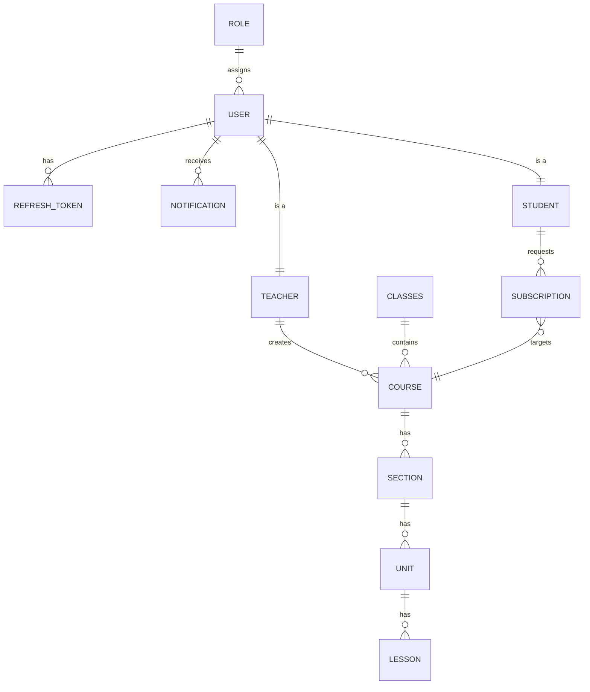

# 🎓 Ta'leem Pro - E-Learning Management System (Backend)

[](https://dotnet.microsoft.com/download/dotnet/8.0)
[]()
[]()
[]()

**Ta'leem Pro** is a robust and scalable backend system for an Educational Management Platform. Built with modern enterprise patterns, it provides a seamless experience for Admins, Teachers, and Students.

🚀 **Live Demo:** [http://learnovaapi.runasp.net/](http://learnovaapi.runasp.net/)

---

## 🛠 Tech Stack

*   **Framework:** .NET 8 Web API
*   **Architecture:** Clean Architecture & Domain-Driven Design (DDD)
*   **Pattern:** CQRS with MediatR
*   **Database:** SQL Server with Entity Framework Core
*   **Authentication:** JWT (JSON Web Tokens) & Google OAuth (Ready)
*   **Real-time:** SignalR for Instant Notifications
*   **Validation:** FluentValidation
*   **Email Service:** MailKit (Smtp Integration)

---

## 🏗 Architecture Overview

The project follows the **Clean Architecture** principles to ensure decoupling and maintainability:
1.  **Domain:** Core entities, value objects, domain events, and repository interfaces.
2.  **Application:** Use cases (Commands/Queries), Handlers, DTOs, and Business Logic.
3.  **Infrastructure:** Data access (EF Core), File storage, Identity, and External services.
4.  **Api:** Controllers, Middlewares, and Program configuration.

---

## 📊 Database Schema & UML (ERD)

Below is the entity-relationship representation of the system:



### 📋 Main Database Tables:
*   **Users:** Stores core account info (Auth).
*   **Roles:** Admin, Teacher, Student roles.
*   **Courses:** Metadata for courses (Title, Price, Image, TeacherId).
*   **Sections / Units / Lessons:** The educational hierarchy.
*   **StudentSubscriptions:** Handles payment proof and course access approval.
*   **Notifications:** System logs and real-time alerts.
*   **RefreshTokens:** Manages long-lived sessions.

---

## ✨ Key Features

-   **Authentication System:** Secure login/register, JWT management, and Password Reset flow via Email.
-   **Content Management:** Hierarchical structure for educational content (Course -> Section -> Unit -> Lesson).
-   **Subscription Lifecycle:** Students can request access by uploading receipts; Admins can Accept/Reject requests.
-   **Real-time Alerts:** Instant SignalR notifications when a course is added, updated, or an account is modified.
-   **File Management:** Specialized service for handling image and video uploads to protected directories.
-   **Streaming:** Protected video streaming to prevent unauthorized content downloading.

---

## ⚙️ How to Run Locally

1.  **Clone the repository:**
    ```bash
    git clone https://github.com/ahmadyoussefabuhassan/E-Learning.git
    ```
2.  **Configure settings:**
    *   Update `appsettings.json` with your **SQL Server Connection String**.
    *   Add your **JWT Key** and **Email Settings**.
3.  **Apply Migrations:**
    ```powershell
    Update-Database
    ```
4.  **Run the project:**
    ```bash
    dotnet run --project E-Learning.Api
    ```

---

## 📧 Contact & Support
Developed by **Ahmad Youssef Abu Hassan**.  
Feel free to reach out if you have any questions!

```
